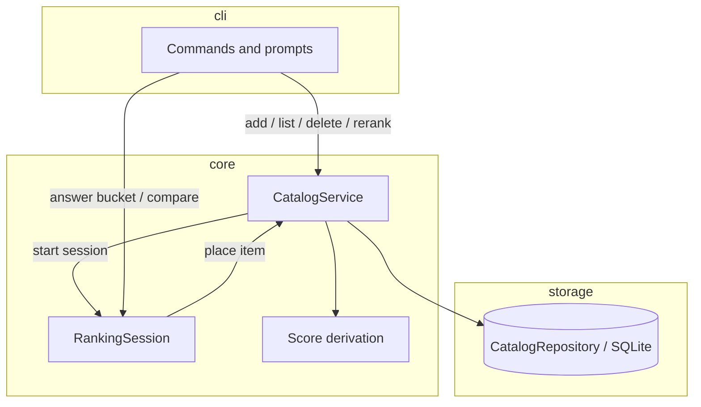

# Plan: rank-it

**Approved:** 2026-08-09

## Status

- [x] Commit 1: Pure ranking engine
- [x] Commit 2: Catalog operations
- [ ] Commit 3: SQLite persistence
- [ ] Commit 4: Basic CLI

## Goal

Build a local-first MVP with three independent catalogs—movies, TV shows, and video games—where completed items can be recorded, compared pairwise, and maintained as a ranked list within their own category.

## Architectural decisions

1. Use TypeScript and Node in a Nix flake development shell so the initial CLI and future interfaces can share one reproducible toolchain.
2. Start with a CLI that exercises the ranking core without committing to a long-term interface.
3. Persist data in local SQLite.
4. Separate the pure ranking core, storage adapter, and CLI.
5. Maintain independent ordering spaces for movies, TV shows, and video games.

## Design decisions

1. Place new items using binary insertion driven by pairwise comparisons; ordered position is authoritative.
2. Ask for a bad, okay, or great bucket before binary-searching within that region.
3. Derive a display-only 0.0–10.0 score from each item's position.
4. Require a title and allow optional year and notes; do not integrate external metadata in v1.
5. Expose ranking as a stateful core session that yields one prompt at a time.
6. Delete by compacting the list; re-rank by removing and reinserting the item.
7. Require a binary choice in v1 and defer ties or “can't decide.”

## Approach

Build a small TypeScript package with a pure ranking engine and SQLite-backed catalogs. Expose it through a CLI that supports adding an item, selecting a coarse bucket, answering pairwise prompts, and viewing or maintaining ranked lists. Keep all interface concerns outside the core.

## Boundaries

- `core` owns categories, items, ranking sessions, catalog use cases, and score derivation. It performs no I/O.
- `storage` implements the core repository port with SQLite and translates database rows at the boundary.
- `cli` parses commands, presents prompts, and prints results. The composition root connects it to core and storage.

## Contracts

```
CLI → CatalogService.addItem
  input:  { category, title, year?, notes? }
  output: RankingSession
  invariant: the item is not placed until the session completes

CLI → RankingSession.next
  input:  none
  output: { type: "bucket" }
        | { type: "compare", against: Item }
        | { type: "done", item: RankedItem }
  invariant: a session has at most one outstanding prompt

CLI → RankingSession.answer
  input:  { bucket: "bad" | "okay" | "great" }
        | { better: boolean }
  output: the next session state
  invariant: answers must match the outstanding prompt;
             a session is deterministic for a given answer sequence

CLI → CatalogService.list
  input:  { category }
  output: RankedItem[]
  invariant: output is ordered best-first and scores are derived, not stored

CLI → CatalogService.delete
  input:  { category, itemId }
  output: void
  invariant: remaining items retain relative order and positions compact

CLI → CatalogService.rerank
  input:  { category, itemId }
  output: RankingSession
  invariant: the item is removed before using the same placement flow as add

CatalogService → CatalogRepository
  input/output: items and best-first ordered positions within one category
  invariant: categories never share an ordering space
```

## Investigation

- The repository was greenfield when planning began, so there were no local implementation conventions to match.
- Beli-style ranking uses a coarse tier followed by binary insertion, then derives a 0.0–10.0 score from position.
- The core must be testable without SQLite or a terminal.
- Anchor path: `src/core/` for framework-free domain behavior.
- Anchor path: `src/storage/` for SQLite translation and persistence.
- Anchor path: `src/cli/` for terminal-only concerns.

## Diagram



## Increments

Each increment is one local commit on `main`, in order. No remote operations or pull requests are part of this plan.

### Commit 1: Pure ranking engine

- **Story:** Establish domain types and deterministic Beli-style binary insertion.
- **Edits:** Nix development shell; TypeScript setup; categories and items; bucket ranges; `RankingSession`; score derivation; unit tests.
- **Depends on:** none.
- **Acceptance:**
  - [ ] Three categories are distinct and cannot be mixed.
  - [ ] New items are placed correctly after bucket and comparison answers.
  - [ ] Comparison count is logarithmic within the selected band.
  - [ ] Scores derive correctly from ordered positions.

### Commit 2: Catalog operations

- **Story:** Add use cases over a repository contract without tying core behavior to storage.
- **Edits:** `CatalogRepository` port; `CatalogService`; add, list, delete, and re-rank flows; in-memory test repository.
- **Depends on:** Commit 1 — uses ranking sessions and domain types.
- **Acceptance:**
  - [ ] Completed sessions persist item order.
  - [ ] Listing returns ordered items with derived scores.
  - [ ] Delete preserves relative order.
  - [ ] Re-rank removes and reinserts an item.

### Commit 3: SQLite persistence

- **Story:** Persist catalogs locally across process restarts.
- **Edits:** SQLite schema, repository adapter, migrations/bootstrap, and integration tests.
- **Depends on:** Commit 2 — implements its repository contract.
- **Acceptance:**
  - [ ] Items and ranking positions survive reopening the database.
  - [ ] Each category has an independent ordering.
  - [ ] Writes preserve ordering invariants.
  - [ ] Integration tests use an isolated temporary database.

### Commit 4: Basic CLI

- **Story:** Make the full workflow usable from a terminal.
- **Edits:** Composition root and commands for `add`, `list`, `delete`, and `rerank`; interactive bucket/comparison prompts; concise output.
- **Depends on:** Commit 3 — composes catalog operations with SQLite.
- **Acceptance:**
  - [ ] A user can add and rank an item interactively.
  - [ ] Lists show position, score, title, and optional metadata.
  - [ ] Delete and re-rank work from the CLI.
  - [ ] Invalid input produces clear errors without corrupting data.

## Tradeoffs & risks

- A CLI-first interface makes a later web or native interface a new adapter, provided the core remains pure.
- Requiring a choice keeps v1 small but makes genuinely close comparisons awkward.
- SQLite adds setup compared with JSON but avoids hand-rolled consistency as catalogs grow.
- Coarse bucket boundaries must be stable and documented in the core.
- Local commits provide clean review boundaries without creating remote artifacts.

## Open questions

- **defer:** Soft ties or “can't decide” handling.
- **defer:** Import, export, and cloud synchronization.
- **defer:** Rich metadata such as posters, platforms, and third-party IDs.

## Plan drift

2026-08-09: Added a Nix flake development shell to Commit 1 after confirming Nix is the project's development-environment convention.
